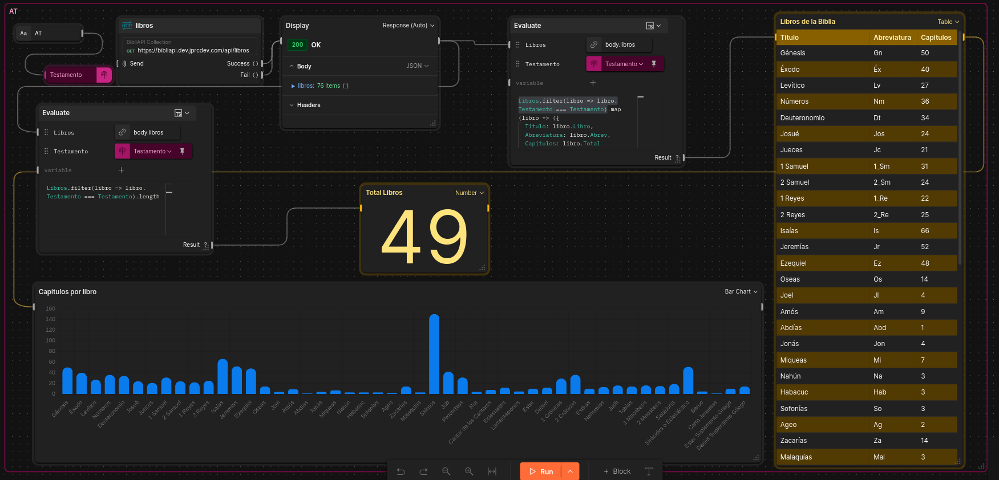
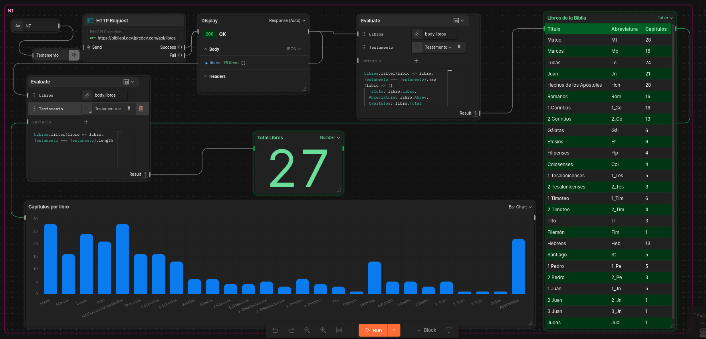

## API de la Biblia

- Instalar las dependencias en el entorno virtual

```bash
BibliAPI/.venv/bin/python -m pip install -r requirements.txt
```

- Ejecutar la API

```bash
BibliAPI/.venv/bin/python src/app.py
```

- Resultado de la ejecución
```log
 * Serving Flask app 'app'
 * Debug mode: on
WARNING: This is a development server. Do not use it in a production deployment. Use a production WSGI server instead.
 * Running on http://127.0.0.1:5000
Press CTRL+C to quit
 * Restarting with stat
 * Debugger is active!
 * Debugger PIN: 257-596-096
127.0.0.1 - - [16/Jan/2025 12:16:16] "GET /api/libros HTTP/1.1" 200 -
127.0.0.1 - - [16/Jan/2025 12:17:37] "GET /api/libros HTTP/1.1" 200 -
127.0.0.1 - - [16/Jan/2025 12:17:37] "GET /favicon.ico HTTP/1.1" 404 -
127.0.0.1 - - [16/Jan/2025 12:20:38] "GET /docs/swagger-ui-standalone-preset.js HTTP/1.1" 200 -
127.0.0.1 - - [16/Jan/2025 12:20:38] "GET /docs/swagger-ui.css HTTP/1.1" 200 -
127.0.0.1 - - [16/Jan/2025 12:20:38] "GET /docs/swagger-ui-bundle.js HTTP/1.1" 200 -
127.0.0.1 - - [16/Jan/2025 12:20:38] "GET /docs/index.css HTTP/1.1" 200 -
127.0.0.1 - - [16/Jan/2025 12:20:38] "GET /static/swagger.json HTTP/1.1" 200 -
127.0.0.1 - - [16/Jan/2025 12:20:38] "GET /docs/favicon-32x32.png HTTP/1.1" 200 -
127.0.0.1 - - [16/Jan/2025 12:20:51] "GET /static/swagger.json HTTP/1.1" 200 -
127.0.0.1 - - [16/Jan/2025 12:22:03] "GET /api/libros HTTP/1.1" 200 -
127.0.0.1 - - [16/Jan/2025 12:22:23] "GET /api/versiculos?referencia=Gn%201,%201 HTTP/1.1" 200 -
```

- La API de la Biblia, que permite:
    - obtener información sobre libros, capítulos y versículos de la Biblia.
    - obtener el contenido de los versículos que se solicitan de la Biblia.

### Version 1.0.0

- Se ha creado una API para obtener información sobre libros, capítulos y versículos de la Biblia.
- Se ha creado una API para obtener el contenido de los versículos que se solicitan de la Biblia.

Ejemplos de uso:

## Por abreviatura

obtener el contenido de los versículos de Salmos 2, 7- (hasta el final del capítulo que es el versículo 12)

GET http://localhost:5000/api/versiculos?referencia=Sal%202,%207-

Devuelve:

```json
{
    "referencia": {
        "libro": {
            "abreviatura": "Sal",
            "nombre": "Salmos",
            "testamento": "AT"
        },
        "capitulo": 2,
        "versiculos": "7-"
    },
    "versiculos": [
        "7 Voy a proclamar el decreto del Señor: El me ha dicho: «Tú eres mi hijo, yo te he engendrado hoy",
        "8 Pídeme, y te daré las naciones como herencia, y como propiedad, los confines de la tierra.",
        "9 Los quebrarás con un cetro de hierro, los destrozarás como a un vaso de arcilla.",
        "10 Por eso, reyes, sean prudentes; aprendan, gobernantes de la tierra.",
        "11 Sirvan al Señor con temor; temblando, ríndanle homenaje, no sea que se irrite y vayan a la ruina, porque su enojo se enciende en un instante. ¡Felices los que se refugian en él!"
    ]
}
```

## Por nombre completo
GET http://localhost:5000/api/versiculos?referencia=Salmos%202,%207-

Devuelve:

```json
{
    // ... mismo formato que en el ejemplo anterior
}
``` 

## Intervalo abierto al inicio
GET http://localhost:5000/api/versiculos?referencia=Salmos%203,%-3

Devuelve:

```json
{
    "referencia": {
        "libro": {
            "abreviatura": "Sal",
            "nombre": "Salmos",
            "testamento": "AT"
        },
        "capitulo": 3,
        "versiculos": "-3"
    },
    "versiculos": [
        "1 ¿Por qué se amotinan las naciones y los pueblos hacen vanos proyectos?",
        "2 Los reyes de la tierra se sublevan, y los príncipes conspiran contra el Señor y contra su Ungido:",
        "3 “Rompamos sus ataduras, librémonos de su yugo”."
    ]
}
```

## Lista de libros
GET http://localhost:5000/api/libros

Devuelve:

```json
[
 {
  "libros": [
    {...},
    {
      "Abrev": "Heb",
      "Libro": "Hebreos",
      "Total": 13,
      "testamento": "NT"
    },
    {
      "Abrev": "St",
      "Libro": "Santiago",
      "Total": 5,
      "testamento": "NT"
    },
    {
      "Abrev": "1_Pe",
      "Libro": "1_Pedro",
      "Total": 5,
      "testamento": "NT"
    },
    {
      "Abrev": "2_Pe",
      "Libro": "2_Pedro",
      "Total": 3,
      "testamento": "NT"
    },
    {
      "Abrev": "1_Jn",
      "Libro": "1_Juan",
      "Total": 5,
      "testamento": "NT"
    },
    {
      "Abrev": "2_Jn",
      "Libro": "2_Juan",
      "Total": 1,
      "testamento": "NT"
    },
    {
      "Abrev": "3_Jn",
      "Libro": "3_Juan",
      "Total": 1,
      "testamento": "NT"
    },
    {
      "Abrev": "Jud",
      "Libro": "Judas",
      "Total": 1,
      "testamento": "NT"
    },
    {
      "Abrev": "Ap",
      "Libro": "Apocalipsis",
      "Total": 22,
      "testamento": "NT"
    },
    {...}
]
```

- añadir documentación con swagger

```bash
flask-swagger-ui==4.11.1
```
- acceso a la documentación

http://localhost:5000/docs

- acceso al archivo swagger.json

http://localhost:5000/static/swagger.json

## Información en Imagenes

### Antiguo Testamento



### Nuevo Testamento

